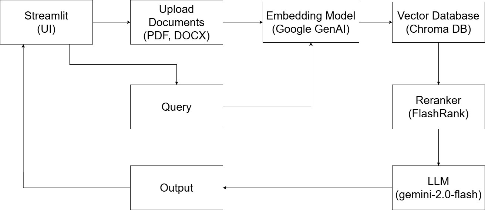

# Intelligent Document Q&A System
A Retrieval-Augmented Generation (RAG) system designed to query documents efficiently.

## Features

- Query PDFs and other internal documents using AI.
- Powered by **LangChain**, **Google API**, and **ChromaDB** for fast retrieval.
- Provides a **FastAPI** endpoint for easy integration.
- Deployed in a **Docker container** for portability and scalability.

## Tech Stack

- **LangChain** - Orchestrates the retrieval and generation pipeline.
- **LLM Model** - Google Generative AI API (gemini-2.0-flash)
- **Embedding Model** - Google Generative AI Embedding (text-embedding-004)
- **Reranker Model** - FlashRank (ce-esci-MiniLM-L12-v2)
- **ChromaDB** - Vector database for document embeddings.
- **FastAPI** - Exposes an API endpoint for querying.
- **Streamlit** - Frontend web UI for interacting with the assistant.
- **Docker** - Containerized deployment.

## Usage

1. Clone the repository:

```bash
git clone https://github.com/vinomz/intelligent-document-qa-system.git
cd intelligent-document-qa-system
```

2. Build and start the docker container:

```bash
docker compose up --build
```

This will:

- Install all required Python packages inside the container
- Launch FastAPI at http://localhost:5050
- Launch Streamlit at http://localhost:8501

## Architecture Diagram

